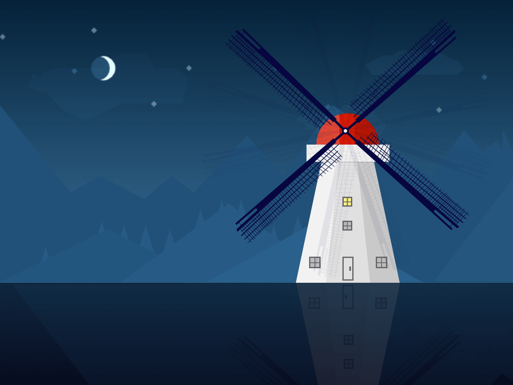
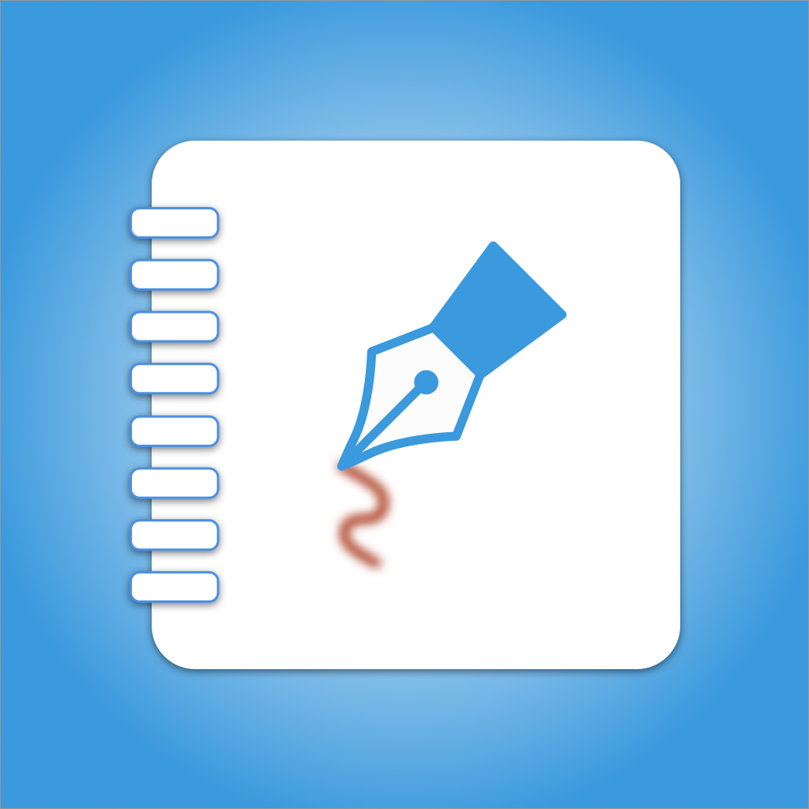

## Scrawl

Sketch 瞎涂个鸦、临摹。

 [临摹夜色](https://design.tutsplus.com/tutorials/how-to-create-a-windmill-illustration-in-sketch--cms-26624)

## icon

以上附带 `.sketch` 源文件。

## License	

Scrawl is released under the [MIT license](LICENSE). See LICENSE for details.

